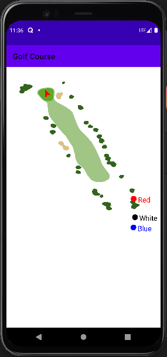

# Golfbert Demo

This project is a small demo to plot a golf and related markers using the [golfBert](https://golfbert.com/api/samples) api

Currently this application uses a cached golf hole data from golfbert api.

It uses custom view to paint the golf hole

### Below is an example of the plotted hole
